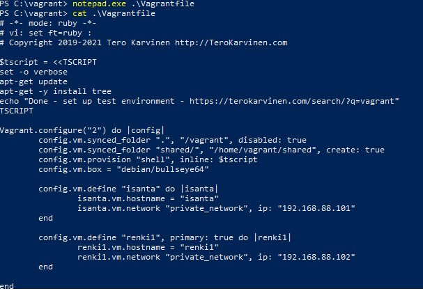

# h6 Kulkurin projekti

Testaukset tehty VirtualBoxin (Version 6.1.26 r145957 (Qt5.6.2)) kautta Ubuntu 22.04 LTS sekä Debian 11 (Bullseye)-distroilla. Prosessorina Intel(R) Core(TM) i7-8700K CPU @ 3.70GHz

## x) Lue ja tiivistä (muutamalla ranskalaisella viivalla per artikkeli, poimi esim itsellesi keskeisimmät komennot)

[Karvinen 2017: Vagrant Revisited – Install & Boot New Virtual Machine in 31 seconds (Suosittelen käyttämään tässä koneena 'vagrant init debian/bullseye64')](https://terokarvinen.com/2017/04/11/vagrant-revisited-install-boot-new-virtual-machine-in-31-seconds/)

- Pikaohjeet Vagranttiin (ja myös virtualboxin asennus)
- Uusi kone Vagrantilla esim:

 ```
 $ vagrant init debian/bullseye64
 $ vagrant up
 #ssh-yhteyden luonti
 $ vagrant ssh
 ```
- Virtuaalikoneen poistaminen `$ vagrant destroy`

[Karvinen 2021: Two Machine Virtual Network With Debian 11 Bullseye and Vagrant](https://terokarvinen.com/2021/two-machine-virtual-network-with-debian-11-bullseye-and-vagrant/)

- Sisältää yllämainitut ohjeet ohjelmistojen asentamiseen
- `Vagrantfile`-tiedostoon luodaan (tässä tapauksessa) kahden virtuaalikoneen luonti samanaikaisesti
- Koneita pystyy luomaan niin monta kuin haluaa lisäämällä Vagrantfileen lisää koneenmääritysrivejä
- Koneita (hosteja) voi testata esimerkiksi pingaamalla
- Sisältää myös troubleshootingin jos esimerkkinä annettu ip-osoite on järjestelmän sallitun rangen ulkopuolella

[Karvinen 2018: Salt Quickstart – Salt Stack Master and Slave on Ubuntu Linux](https://terokarvinen.com/2018/salt-quickstart-salt-stack-master-and-slave-on-ubuntu-linux/)

- Tiivistys kopioitu aiemmista läksyistä: [https://github.com/sawulohi/Palvelinten-Hallinta-Syksy-2022/blob/main/h2_package_file_service.md](https://github.com/sawulohi/Palvelinten-Hallinta-Syksy-2022/blob/main/h2_package_file_service.md)
- Ohjeistus Salt Masterin ja Salt Minionin asennukseen sekä Minionin konfigurointiin
- Masterin asennuskomennot ja oman masterin osoitteen selvitys:
``` 
$ sudo apt-get update
$ sudo apt-get -y install salt-master
$ hostname -I
10.0.2.15
```
- Palomuurin ollessa käytössä portit 4505/tcp ja 4506/tcp tulee avata
- Slaven asennus ja konfigurointi masteriin yhdistämistä varten:
``` 
$ sudo apt-get update
$ sudo apt-get -y install salt-minion
$ sudoedit /etc/salt/minion
```
Laitetaan minion config-tiedostoon masterin osoite ja minionille haluttu nimi.
```
master: 10.0.2.15
id: minion-1
```
Tallenna ja poistu editorista. Käynnistä vielä demoni uudelleen, jotta säädetyt asetukset tulevat voimaan:
```
$ sudo systemctl restart salt-minion.service
```
- Hyväksy uuden orjan avain *masterilla*:
```
$ sudo salt-key -A
The following keys are going to be accepted:
Unaccepted Keys:
minion-1
Proceed? [n/Y] Y
Key for minion minion-1 accepted.
```
Testaukset esimerkiksi (*masterilla*):
```
$sudo salt '*' cmd.run 'whoami'
minion-1:
    root
``` 

## a) Hello Vagrant. Asenna virtuaalikone Vagrantilla.

Hostikoneeni on Windowsilla, ja yllä annetut ohjeet ovat Linuxille. Olisin toki voinut kokeilla asentaa VirtualBoxin virtuaalikoneelleni, mutta tämä kuulosti hassulta ajatukselta. Asensin [Vagrantin](https://releases.hashicorp.com/vagrant/2.3.3/vagrant_2.3.3_windows_amd64.msi) koneelleni oppitunnilla. Tämän lisäksi olen myös asentanut [VirtualBoxin](https://download.virtualbox.org/virtualbox/7.0.4/VirtualBox-7.0.4-154605-Win.exe) aiemmin.

Kun nuo alkuvaatimukset olivat täytetty, käynnistin Windowsin PowerShellin admin-oikeuksilla (Windows-näppäin + x -> Windows PowerShell(Admin)).

```
PS C:\> mkdir vagrant


    Directory: C:\


Mode                 LastWriteTime         Length Name
----                 -------------         ------ ----
d-----         12/6/2022   5:42 PM                vagrant


PS C:\> cd .\vagrant\
PS C:\vagrant> vagrant init debian/bullseye64
A `Vagrantfile` has been placed in this directory. You are now
ready to `vagrant up` your first virtual environment! Please read
the comments in the Vagrantfile as well as documentation on
`vagrantup.com` for more information on using Vagrant.
PS C:\vagrant> vagrant up
Bringing machine 'default' up with 'virtualbox' provider...
==> default: Importing base box 'debian/bullseye64'...
==> default: Matching MAC address for NAT networking...
==> default: Checking if box 'debian/bullseye64' version '11.20220912.1' is up to date...
==> default: Setting the name of the VM: vagrant_default_1670341397918_86869
==> default: Clearing any previously set network interfaces...
==> default: Preparing network interfaces based on configuration...
    default: Adapter 1: nat
==> default: Forwarding ports...
    default: 22 (guest) => 2222 (host) (adapter 1)
==> default: Booting VM...
==> default: Waiting for machine to boot. This may take a few minutes...
    default: SSH address: 127.0.0.1:2222
    default: SSH username: vagrant
    default: SSH auth method: private key
    default:
    default: Vagrant insecure key detected. Vagrant will automatically replace
    default: this with a newly generated keypair for better security.
    default:
    default: Inserting generated public key within guest...
    default: Removing insecure key from the guest if it's present...
    default: Key inserted! Disconnecting and reconnecting using new SSH key...
==> default: Machine booted and ready!
==> default: Checking for guest additions in VM...
    default: The guest additions on this VM do not match the installed version of
    default: VirtualBox! In most cases this is fine, but in rare cases it can
    default: prevent things such as shared folders from working properly. If you see
    default: shared folder errors, please make sure the guest additions within the
    default: virtual machine match the version of VirtualBox you have installed on
    default: your host and reload your VM.
    default:
    default: Guest Additions Version: 6.0.0 r127566
    default: VirtualBox Version: 6.1
==> default: Mounting shared folders...
    default: /vagrant => C:/vagrant

==> default: Machine 'default' has a post `vagrant up` message. This is a message
==> default: from the creator of the Vagrantfile, and not from Vagrant itself:
==> default:
==> default: Vanilla Debian box. See https://app.vagrantup.com/debian for help and bug reports
PS C:\vagrant> vagrant ssh
Linux bullseye 5.10.0-18-amd64 #1 SMP Debian 5.10.140-1 (2022-09-02) x86_64

The programs included with the Debian GNU/Linux system are free software;
the exact distribution terms for each program are described in the
individual files in /usr/share/doc/*/copyright.

Debian GNU/Linux comes with ABSOLUTELY NO WARRANTY, to the extent
permitted by applicable law.
Linux bullseye 5.10.0-18-amd64 #1 SMP Debian 5.10.140-1 (2022-09-02) x86_64

The programs included with the Debian GNU/Linux system are free software;
the exact distribution terms for each program are described in the
individual files in /usr/share/doc/*/copyright.

Debian GNU/Linux comes with ABSOLUTELY NO WARRANTY, to the extent
permitted by applicable law.
vagrant@bullseye:~$

```

Vagrantilla luotu virtuaalikone vaikuttaisi olevan toiminnassa, sillä siihen saatiin ssh-yhteys. Lisävarmistukseksi katsoin vielä, että virtuaalikone löytyi VirtualBoxista.


Ja siellähän se näkyi olevan pyörimässä! Tuhosin vielä tämän koneen seuraavaa tehtävää varten:
```
vagrant@bullseye:~$ exit
logout
Connection to 127.0.0.1 closed.
PS C:\vagrant> vagrant destroy
    default: Are you sure you want to destroy the 'default' VM? [y/N] y
==> default: Forcing shutdown of VM...
==> default: Destroying VM and associated drives...
```
Virtuaalikone poistui onnistuneesti.

## b) Yksityisverkko. Asenna kaksi virtuaalikonetta samaan verkkoon Vagrantilla. Laita toisen koneen nimeksi "isanta" ja toisen "renki1". Kokeile, että "renki1" saa yhteyden koneeseen "isanta" (esim. ping tai nc). Tehtävä tulee siis tehdä alusta, vaikka olisit ehtinyt kokeilla tätä tunnilla.

Avasin Vagrantin luoman `Vagrantfile`n notepadilla, ja korvasin sen sisällön https://terokarvinen.com/2021/two-machine-virtual-network-with-debian-11-bullseye-and-vagrant/ saadulla sisällöllä. Vaihdoin myös hostien nimet tehtävänannon mukaan.



Sitten ajoin `vagrant up`illa. Asennuksessa kesti hetkinen. Se näytti kuitenkin onnistuneen:


Otin ssh-yhteyden renkiin verkon testaamista varten ja testasin sitä pingaamalla:

```
PS C:\vagrant> vagrant ssh renki1
vagrant@renki1:~$ ping -c 2 192.168.88.101
PING 192.168.88.101 (192.168.88.101) 56(84) bytes of data.
64 bytes from 192.168.88.101: icmp_seq=1 ttl=64 time=0.316 ms
64 bytes from 192.168.88.101: icmp_seq=2 ttl=64 time=1.12 ms

--- 192.168.88.101 ping statistics ---
2 packets transmitted, 2 received, 0% packet loss, time 1010ms
rtt min/avg/max/mdev = 0.316/0.717/1.118/0.401 ms
```
Yhteys toimii ainakin ping-testin perusteella. Osoitteen testiä varten katsoin aiemmin säädetystä Vagrantfilestä.

## c) Salt master-slave. Toteuta Salt master-slave -arkkitehtuuri verkon yli. Aseta edellisen kohdan kone renki1 orjaksi koneelle isanta.

Asensin isanta-koneelle salt-masterin ja renki1-koneelle salt-minionin (tein nämä samanaikaisesti kahdella instanssilla PowerShelliä):

```
*MASTER:*

PS C:\vagrant> vagrant ssh isanta
vagrant@isanta:~$ sudo apt-get update
vagrant@isanta:~$ sudo apt-get -y install salt-master 

*SLAVE:*
PS C:\vagrant> vagrant ssh isanta
vagrant@renki1:~$ sudo apt-get update
vagrant@renki1:~$ sudo apt-get -y install salt-minion
vagrant@renki1:~$ sudoedit /etc/salt/minion
master: 192.168.88.101
id: renki1
vagrant@renki1:~$ sudo systemctl restart salt-minion.service

*MASTER:*
vagrant@isanta:~$ sudo salt-key -A
The following keys are going to be accepted:
Unaccepted Keys:
renki1
Proceed? [n/Y] y
Key for minion renki1 accepted.

vagrant@isanta:~$ sudo salt renki1 cmd.run 'whoami'
renki1:
    root

```

Arkkitehtuuri asentui onnistuneesti. Tämän tiesin viimeisimmällä komennolla, kutsuin renkiä 'whoami'-komennolla testiksi.

## d) Oma suola. Tee ensimmäinen työversio projektistasi. Miniprojektilla tulee olla jokin tarkoitus, vaikka se olisi keksitty. Projektilla tulee olla sivu (esim. Github, Gitlab...), josta selviää projektin perustiedot. Toiminnallisuutta tulee olla kokeiltu, mutta sen ei tarvitse olla valmis. Valmiit projektit esitellään viimeisellä tapaamiskerralla. Tässä tehtävässä palautettava työversio ei siis ole vielä lopullinen.

Aloitin työstämään projektia osoitteessa https://github.com/sawulohi/h7
Projektin edistymistä voi seurata sieltä.
